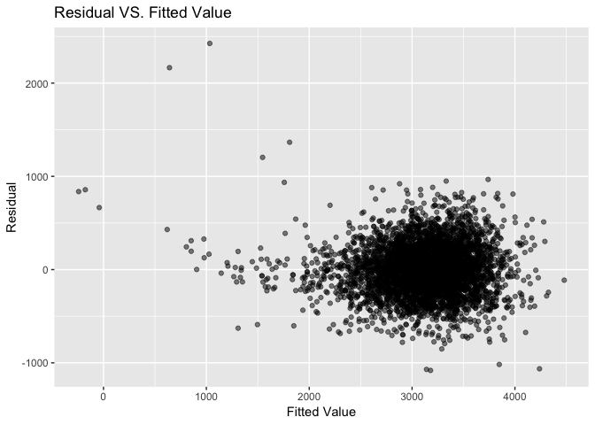
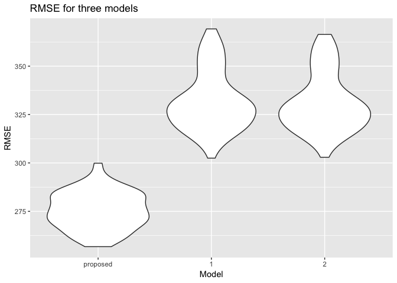

p8105\_hw6\_hy2580
================
haokun yuan
11/19/2018

### Problem 1

The Washington Post has gathered data on homicides in 50 large U.S. cities and made the data available through a GitHub repository here. You can read their accompanying article here.

Create a city\_state variable (e.g. “Baltimore, MD”), and a binary variable indicating whether the homicide is solved. Omit cities Dallas, TX; Phoenix, AZ; and Kansas City, MO – these don’t report victim race. Also omit Tulsa, AL – this is a data entry mistake. Modifiy victim\_race to have categories white and non-white, with white as the reference category. Be sure that victim\_age is numeric.

``` r
homicide_data = read_csv("./data/homicide-data.csv") %>% 
  janitor::clean_names() %>% 
  mutate(city_state = paste(city, state, sep = ", ")) %>% 
  filter(city_state != "Dallas, TX" & city_state != "Phoenix, AZ" & city_state != "Kansas City, MO" & city_state != "Tulsa, AL") %>% 
  mutate(victim_race = ifelse(victim_race == "White", "white", "non_white"),
         victim_race = fct_relevel(victim_race, "white"),
         victim_age = as.numeric(victim_age),
         resolved = as.numeric(disposition == "Closed by arrest"),
         unresolved = as.numeric(disposition != "Closed by arrest")) %>%
  filter(victim_age != "NA")
```

    ## Warning in evalq(as.numeric(victim_age), <environment>): NAs introduced by
    ## coercion

For the city of Baltimore, MD, use the glm function to fit a logistic regression with resolved vs unresolved as the outcome and victim age, sex and race (as just defined) as predictors. Save the output of glm as an R object; apply the broom::tidy to this object; and obtain the estimate and confidence interval of the adjusted odds ratio for solving homicides comparing black victims to white victims keeping all other variables fixed.

``` r
baltimore_df = homicide_data %>% 
  filter(city_state == "Baltimore, MD") %>% 
  select(resolved, victim_age, victim_race, victim_sex)

fit_logistic = baltimore_df %>% 
  glm(resolved ~ victim_age + victim_race + victim_sex, data = ., family = binomial())

baltimore_fit = fit_logistic %>% 
  broom::tidy() %>% 
  mutate(OR = exp(estimate)) %>%
  select(term, log_OR = estimate, OR, p.value) %>% 
  filter(term == "victim_racenon_white")

CI = exp(confint(fit_logistic)) %>% broom::tidy() %>% 
  rename(term = .rownames, conf_low = X2.5.., conf_high = X97.5..)
```

    ## Warning: 'tidy.matrix' is deprecated.
    ## See help("Deprecated")

``` r
left_join(baltimore_fit, CI)
```

    ## # A tibble: 1 x 6
    ##   term                 log_OR    OR    p.value conf_low conf_high
    ##   <chr>                 <dbl> <dbl>      <dbl>    <dbl>     <dbl>
    ## 1 victim_racenon_white -0.820 0.441 0.00000268    0.312     0.620

Now run glm for each of the cities in your dataset, and extract the adjusted odds ratio (and CI) for solving homicides comparing black victims to white victims. Do this within a “tidy” pipeline, making use of purrr::map, list columns, and unnest as necessary to create a dataframe with estimated ORs and CIs for each city.

``` r
city_fit = homicide_data %>% 
  select(city_state, resolved, victim_age, victim_race, victim_sex) %>% 
  group_by(city_state) %>% 
  nest() %>% 
  mutate(models = map(data, ~glm(resolved ~ victim_age + victim_race + victim_sex, data =.x)),
         parameter = map(models,broom::tidy),
         parameter2 = map(models, confint),
         parameter3 = map(parameter2, broom::tidy),
         parameter4 = map2(parameter3,parameter, ~merge.data.frame(x=.x, y=.y, by.x = ".rownames", by.y = "term"))) %>%
  select(-parameter,-parameter2,-parameter3) %>% 
  unnest(parameter4) %>%
  mutate(conf_low = X2.5.., conf_high = X97.5..) %>% 
  mutate(OR = exp(estimate),
         conf_low = exp(conf_low),
         conf_high = exp(conf_high),
         term = .rownames
         ) %>% 
  select(city_state, term, OR, conf_low, conf_high) %>% 
  filter(term == "victim_racenon_white")

city_fit
```

    ## # A tibble: 47 x 5
    ##    city_state      term                    OR conf_low conf_high
    ##    <chr>           <chr>                <dbl>    <dbl>     <dbl>
    ##  1 Albuquerque, NM victim_racenon_white 0.938    0.844     1.04 
    ##  2 Atlanta, GA     victim_racenon_white 0.936    0.824     1.06 
    ##  3 Baltimore, MD   victim_racenon_white 0.824    0.762     0.892
    ##  4 Baton Rouge, LA victim_racenon_white 0.912    0.766     1.09 
    ##  5 Birmingham, AL  victim_racenon_white 1.01     0.888     1.15 
    ##  6 Boston, MA      victim_racenon_white 0.675    0.587     0.776
    ##  7 Buffalo, NY     victim_racenon_white 0.797    0.693     0.917
    ##  8 Charlotte, NC   victim_racenon_white 0.898    0.812     0.994
    ##  9 Chicago, IL     victim_racenon_white 0.882    0.834     0.932
    ## 10 Cincinnati, OH  victim_racenon_white 0.786    0.703     0.880
    ## # ... with 37 more rows

Create a plot that shows the estimated ORs and CIs for each city. Organize cities according to estimated OR, and comment on the plot.

``` r
city_fit %>% 
  mutate(city_state = fct_reorder(city_state, desc(OR))) %>% 
  ggplot(aes(city_state, OR)) +
  geom_point() +
  geom_errorbar(aes(ymin = conf_low, ymax = conf_high)) + 
  theme_bw() +
  theme(axis.text.x = element_text(angle = 90, hjust = 1, size = rel(0.8))) + 
  labs(
      x = "City",
      y = "OR",
      title = "Estimated Odds ratios and CIs of nonwhite victim"
    )
```


### Problem 2

Propose a regression model for birthweight. This model may be based on a hypothesized structure for the factors that underly birthweight, on a data-driven model-building process, or a combination of the two. Describe your modeling process and show a plot of model residuals against fitted values – use add\_predictions and add\_residuals in making this plot.

``` r
birthweight = read_csv("./data/birthweight.csv") 
#removed collinearlity
proposed_data = birthweight %>% 
  select(-pnumlbw, -pnumsga, -ppbmi)
#use stepwise method to select variable
step(lm(bwt ~ .,proposed_data),direction = "both")
```

    ## Start:  AIC=48808.15
    ## bwt ~ babysex + bhead + blength + delwt + fincome + frace + gaweeks + 
    ##     malform + menarche + mheight + momage + mrace + parity + 
    ##     ppwt + smoken + wtgain
    ## 
    ## 
    ## Step:  AIC=48808.15
    ## bwt ~ babysex + bhead + blength + delwt + fincome + frace + gaweeks + 
    ##     malform + menarche + mheight + momage + mrace + parity + 
    ##     ppwt + smoken
    ## 
    ##            Df Sum of Sq       RSS   AIC
    ## - malform   1      3033 328375200 48806
    ## - frace     1     33825 328405992 48807
    ## <none>                  328372167 48808
    ## - menarche  1    161091 328533258 48808
    ## - parity    1    366498 328738665 48811
    ## - momage    1    632022 329004189 48815
    ## - mheight   1    675684 329047851 48815
    ## - fincome   1   1030291 329402457 48820
    ## - babysex   1   1086908 329459074 48820
    ## - mrace     1   1778610 330150776 48830
    ## - smoken    1   3105969 331478135 48847
    ## - ppwt      1   3179601 331551767 48848
    ## - gaweeks   1   5018627 333390793 48872
    ## - delwt     1   7474996 335847163 48904
    ## - blength   1 106590460 434962626 50027
    ## - bhead     1 113972011 442344178 50100
    ## 
    ## Step:  AIC=48806.19
    ## bwt ~ babysex + bhead + blength + delwt + fincome + frace + gaweeks + 
    ##     menarche + mheight + momage + mrace + parity + ppwt + smoken
    ## 
    ##            Df Sum of Sq       RSS   AIC
    ## - frace     1     33987 328409187 48805
    ## <none>                  328375200 48806
    ## - menarche  1    161625 328536825 48806
    ## + malform   1      3033 328372167 48808
    ## - parity    1    366217 328741417 48809
    ## - momage    1    634318 329009517 48813
    ## - mheight   1    674643 329049842 48813
    ## - fincome   1   1028426 329403626 48818
    ## - babysex   1   1085480 329460680 48819
    ## - mrace     1   1780124 330155324 48828
    ## - smoken    1   3103025 331478225 48845
    ## - ppwt      1   3188216 331563416 48846
    ## - gaweeks   1   5016626 333391826 48870
    ## - delwt     1   7493191 335868391 48902
    ## - blength   1 106598488 434973688 50025
    ## - bhead     1 113989429 442364629 50098
    ## 
    ## Step:  AIC=48804.64
    ## bwt ~ babysex + bhead + blength + delwt + fincome + gaweeks + 
    ##     menarche + mheight + momage + mrace + parity + ppwt + smoken
    ## 
    ##            Df Sum of Sq       RSS   AIC
    ## <none>                  328409187 48805
    ## - menarche  1    165498 328574685 48805
    ## + frace     1     33987 328375200 48806
    ## + malform   1      3194 328405992 48807
    ## - parity    1    366935 328776121 48807
    ## - momage    1    637125 329046311 48811
    ## - mheight   1    683740 329092927 48812
    ## - fincome   1   1050875 329460062 48817
    ## - babysex   1   1085276 329494463 48817
    ## - smoken    1   3092717 331501903 48843
    ## - ppwt      1   3192334 331601520 48845
    ## - gaweeks   1   5019197 333428383 48868
    ## - mrace     1   5999337 334408523 48881
    ## - delwt     1   7480901 335890088 48900
    ## - blength   1 106612808 435021995 50023
    ## - bhead     1 114005059 442414245 50096

    ## 
    ## Call:
    ## lm(formula = bwt ~ babysex + bhead + blength + delwt + fincome + 
    ##     gaweeks + menarche + mheight + momage + mrace + parity + 
    ##     ppwt + smoken, data = proposed_data)
    ## 
    ## Coefficients:
    ## (Intercept)      babysex        bhead      blength        delwt  
    ##  -6246.3672      32.3171     134.4298      76.3760       3.9564  
    ##     fincome      gaweeks     menarche      mheight       momage  
    ##      0.6597      12.0396      -4.3140       5.4408       3.4549  
    ##       mrace       parity         ppwt       smoken  
    ##    -53.4990      89.9677      -2.8323      -3.7116

``` r
proposed_data = proposed_data %>% 
  select(bwt, babysex, bhead, blength, delwt, fincome, gaweeks, menarche, mheight, momage, mrace, parity, ppwt, smoken)

reg_proposed = lm(bwt ~ .,proposed_data)

summary(reg_proposed)
```

    ## 
    ## Call:
    ## lm(formula = bwt ~ ., data = proposed_data)
    ## 
    ## Residuals:
    ##      Min       1Q   Median       3Q      Max 
    ## -1081.54  -184.11    -3.95   174.35  2425.63 
    ## 
    ## Coefficients:
    ##               Estimate Std. Error t value Pr(>|t|)    
    ## (Intercept) -6246.3672   143.1342 -43.640  < 2e-16 ***
    ## babysex        32.3171     8.5453   3.782 0.000158 ***
    ## bhead         134.4298     3.4681  38.761  < 2e-16 ***
    ## blength        76.3760     2.0376  37.484  < 2e-16 ***
    ## delwt           3.9564     0.3985   9.929  < 2e-16 ***
    ## fincome         0.6597     0.1773   3.721 0.000201 ***
    ## gaweeks        12.0396     1.4803   8.133 5.42e-16 ***
    ## menarche       -4.3140     2.9211  -1.477 0.139792    
    ## mheight         5.4408     1.8125   3.002 0.002699 ** 
    ## momage          3.4549     1.1923   2.898 0.003778 ** 
    ## mrace         -53.4990     6.0167  -8.892  < 2e-16 ***
    ## parity         89.9677    40.9125   2.199 0.027929 *  
    ## ppwt           -2.8323     0.4367  -6.486 9.79e-11 ***
    ## smoken         -3.7116     0.5814  -6.384 1.90e-10 ***
    ## ---
    ## Signif. codes:  0 '***' 0.001 '**' 0.01 '*' 0.05 '.' 0.1 ' ' 1
    ## 
    ## Residual standard error: 275.5 on 4328 degrees of freedom
    ## Multiple R-squared:  0.7116, Adjusted R-squared:  0.7107 
    ## F-statistic: 821.4 on 13 and 4328 DF,  p-value: < 2.2e-16

``` r
proposed_data %>% 
  modelr::add_residuals(reg_proposed) %>% 
  modelr::add_predictions(reg_proposed) %>% 
  ggplot(aes(pred,resid)) + 
  geom_point(alpha = 0.5) +
  labs(
      x = "Fitted Value",
      y = "Residual",
      title = "Residual VS. Fitted Value"
  )
```



I first check the collinearlity, and removed the variables that I found to have high collinearlity (&gt;70%), and then used stepwise function select variable. The residual vs. fit plot showed that the regression may not be linear, a tranformation is probability needed.

Compare your model to two others:

One using length at birth and gestational age as predictors (main effects only)

``` r
reg_1 = lm(bwt~blength+gaweeks, birthweight)
```

One using head circumference, length, sex, and all interactions (including the three-way interaction) between these

``` r
reg_2 = lm(bwt ~ blength + gaweeks + babysex + blength*gaweeks+blength*gaweeks*babysex + blength*gaweeks*babysex + blength*babysex, birthweight) 
```

Make this comparison in terms of the cross-validated prediction error; use crossv\_mc and functions in purrr as appropriate.

``` r
cv_df = crossv_mc(birthweight, 100) %>% 
  mutate(train = map(train, as_tibble),
         test = map(test, as_tibble))
cv_df = 
  cv_df %>% 
  mutate(proposed_mod = map(train, ~ reg_proposed),
         mod_1 = map(train, ~reg_1),
         mod_2 = map(train, ~ reg_2)) %>% 
  mutate(rmse_proposed    = map2_dbl(proposed_mod, test, ~rmse(model = .x, data = .y)),
         rmse_1 = map2_dbl(mod_1, test, ~rmse(model = .x, data = .y)),
         rmse_2 = map2_dbl(mod_2, test, ~rmse(model = .x, data = .y)))

cv_df %>% 
  select(starts_with("rmse")) %>% 
  gather(key = model, value = rmse) %>% 
  mutate(model = str_replace(model, "rmse_", ""),
         model = fct_inorder(model)) %>% 
  ggplot(aes(x = model, y = rmse)) + 
  geom_violin() +
  labs(x = "Model",
       y = "RMSE",
       title = "RMSE for three models"
    )
```



The rmse for model1 and model 2 is lower than that of the proposed model which indicate proposed model is a better fit.
